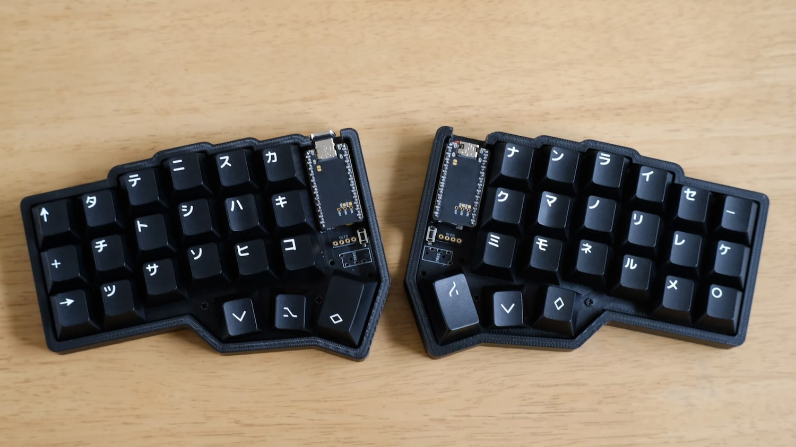

# crkbd-cherry-v3-build

My journey down the rabbit hole.  
Based off [foostan's V3 Corne](https://github.com/foostan/crkbd/releases/tag/v3-final)  
Using [foostan](https://github.com/foostan/crkbd/blob/main/docs/corne-cherry/v3/buildguide_en.md)'s and [rafaeldelboni](https://github.com/rafaeldelboni/buildlogs/blob/main/crkbd-v3.md#compileflash-firmware)'s build guides

**Build**  
- CRKBD V3 3x6 Cherry hot-swap keyboard
- Includes OLED
- No RBG or Bluetooth

**Inspo**  

## Contents
- [ ] [Make parts list](#parts-list)
  - [X] [Building and ordering the PCB](#building-and-ordering-the-pcb)
- [ ] [Install/Configure QMK](#installconfigure-qmk)
- [ ] [Compile/Flash Firmware](#compileflash-firmware)
- [ ] [Prepare the OLEDS](#prepare-oleds)
- [ ] [Prepare the PCB](#prepare-pcb)
- [ ] [Solder PCB top components](#solder-pcb-top-components)
- [ ] [Solder pro-micro](#solder-pro-micro)
- [ ] [Solder OLEDs](#solder-oleds)
- [ ] [Solder diodes](#solder-diodes)
- [ ] [Solder hot-swaps](#solder-hot-swaps)
- [ ] [Solder per-key leds](#solder-per-key-leds)
- [ ] [Mount the case](#mount-the-case)

## Parts list
**Keyboard**
| Name | Count | Details | Price | Buy
|:-|:-|:-|:-| :-|
| PCB | 1x | [Corne PCB Printed using JLCPCB](https://jlcpcb.com/) | $40 | X
| Top Plate | 2x | 1.5-3mm - [Files](https://makerworld.com/en/models/222869#profileId-266205) - Printed at school | $ |
| Bottom Plate | 2x | [Files](https://makerworld.com/en/models/222869#profileId-266205) - Printed at school | $ |
| OLED Cover | 2x | [Print at school](https://www.thingiverse.com/thing:6447342) or [Typeractive](https://typeractive.xyz/products/corne-display-cover) | $ |
| OLED | 2x | [OLED 128X32 OLED Display Module 0.91" IIC Communicate for ardunio](https://www.aliexpress.com/item/32777216785.html?spm=a2g0s.9042311.0.0.27424c4dlrgRjA) | $0.30 | X |
| Microcontroller | 2x | [TZT Pro Micro ATmega32U4 5V 16MHz Original Chip Type-C](https://www.aliexpress.us/item/2251832581993895.html?spm=a2g0s.9042311.0.0.27424c4dlrgRjA&gatewayAdapt=glo2usa4itemAdapt) | $3 | X |
| Keycaps | 42x | Local | $0 | X |
| Switches | 42x | Only compatible with MX style - [Cherry MX Black](https://www.aliexpress.us/item/3256806069646359.html?spm=a2g0o.productlist.main.1.4a497310hnQLCq&algo_pvid=73237be8-dd90-41c8-bd4a-edbb61f7318c&algo_exp_id=73237be8-dd90-41c8-bd4a-edbb61f7318c-0&pdp_npi=4%40dis%21USD%217.83%210.99%21%21%2155.50%216.98%21%402101c5b217243508666094488e10c5%2112000036489552473%21sea%21US%212778608228%21ABX&curPageLogUid=zhhR89q5ZmTu&utparam-url=scene%3Asearch%7Cquery_from%3A#nav-review) | $15 | X |
| DIODES | 100x | [1N4148W T4 SOD-123](https://www.aliexpress.us/item/2251832735176193.html?spm=a2g0o.cart.0.0.624d38dayf8uXk&mp=1&gatewayAdapt=glo2usa) | $1 | X |
| Hot Swaps | 50x | [Kailh Hot-swappable PCB socket Hot Plug for Gateron Outemu Cherry MX Switches Mechanical Keyboard](https://www.aliexpress.us/item/2255800865526224.html?spm=a2g0s.9042311.0.0.27424c4dlrgRjA&gatewayAdapt=glo2usa4itemAdapt) | $8 | X |
| TRRS Cable 4 pole | 1x | [Rallonge Jack 3.5mm 4 3 Pole TRRS to TRRS](https://www.aliexpress.us/item/3256805991501373.html?spm=a2g0o.productlist.main.1.10596d99xhZTwL&algo_pvid=9dde26da-8622-45dc-8815-b85b16e86c14&algo_exp_id=9dde26da-8622-45dc-8815-b85b16e86c14-0&pdp_npi=4%40dis%21USD%214.45%210.99%21%21%2131.54%217.01%21%402101c5b117242987081857098e0582%2112000036149303822%21sea%21US%212778608228%21ABX&curPageLogUid=1JhzGCK9fNj9&utparam-url=scene%3Asearch%7Cquery_from%3A) | $3 | X |
| TRRS jack 4 pole | 2x | [TRRS 3.5 MM Audio Jack Connector](https://www.aliexpress.us/item/2251832843150354.html?spm=a2g0o.productlist.main.1.48111de5AJ9NKs&algo_pvid=5dba46f3-603a-4bae-a23b-4ff6e264e75a&algo_exp_id=5dba46f3-603a-4bae-a23b-4ff6e264e75a-0&pdp_npi=4%40dis%21USD%211.51%210.99%21%21%211.51%210.99%21%402101fb1717243074242777122e20ab%2112000038224902314%21sea%21US%212778608228%21ABX&curPageLogUid=ZP6AutQHqCPa&utparam-url=scene%3Asearch%7Cquery_from%3A) | $2 | X |
| Screw M2 5mm | 50x | [For case](https://www.aliexpress.us/item/3256805432431543.html?spm=a2g0o.productlist.main.7.71d74614yyKWon&algo_pvid=6ee9a92e-cdc7-460a-af3b-ac2b0e62eb9a&aem_p4p_detail=202408212153242149051534836220006711131&algo_exp_id=6ee9a92e-cdc7-460a-af3b-ac2b0e62eb9a-3&pdp_npi=4%40dis%21USD%211.02%210.96%21%21%217.24%216.81%21%402103094f17243024043121319e1b2a%2112000033767212213%21sea%21US%212778608228%21ABX&curPageLogUid=qknRdn84mFma&utparam-url=scene%3Asearch%7Cquery_from%3A&search_p4p_id=202408212153242149051534836220006711131_1) | $1 | X |
| Spacer M2 7mm | 10x | For case - [Spacing Screw Hexagon Copper Female PCB Pillars Bolt M2](https://www.aliexpress.us/item/3256805863280885.html?spm=a2g0o.productlist.main.31.81d0187fZbMQZZ&algo_pvid=6d868c51-1d17-4027-9621-7291015036ed&aem_p4p_detail=2024082122034312246280635684690006792288&algo_exp_id=6d868c51-1d17-4027-9621-7291015036ed-15&pdp_npi=4%40dis%21USD%211.73%210.99%21%21%211.73%210.99%21%402101f00117243030236031082e3709%2112000035491390234%21sea%21US%212778608228%21ABX&curPageLogUid=wCfdJ6WOajxb&utparam-url=scene%3Asearch%7Cquery_from%3A&search_p4p_id=2024082122034312246280635684690006792288_4) | $2 | X |
| Spacer M2 9mm | 10x | For case - [Spacing Screw Hexagon Copper Female PCB Pillars Bolt M2](https://www.aliexpress.us/item/3256805863280885.html?spm=a2g0o.productlist.main.31.81d0187fZbMQZZ&algo_pvid=6d868c51-1d17-4027-9621-7291015036ed&aem_p4p_detail=2024082122034312246280635684690006792288&algo_exp_id=6d868c51-1d17-4027-9621-7291015036ed-15&pdp_npi=4%40dis%21USD%211.73%210.99%21%21%211.73%210.99%21%402101f00117243030236031082e3709%2112000035491390234%21sea%21US%212778608228%21ABX&curPageLogUid=wCfdJ6WOajxb&utparam-url=scene%3Asearch%7Cquery_from%3A&search_p4p_id=2024082122034312246280635684690006792288_4) | $2 | X |
| Controller Base | 4x |[2.54mm Pin Header Female Single Row 40](https://www.aliexpress.us/item/2251832706072027.html?spm=a2g0o.cart.0.0.3b9838daiMt2PN&mp=1&gatewayAdapt=glo2usa) | $5 | X |
| OLED Base | 2x | [2.54 4-pin Female Header Socket](https://www.aliexpress.us/item/2255801025567520.html?gatewayAdapt=glo2usa4itemAdapt) | $ | X |
| Pins | 50x | [PC Pins](https://www.digikey.com/en/products/detail/mill-max-manufacturing-corp/3320-0-00-15-00-00-03-0/4147392) | $8 | X
| Switch Push Button | 2x | [3X6 4.3mm DIP](https://www.aliexpress.us/item/2255801131587911.html?spm=a2g0o.productlist.main.11.25c42ab7945L0g&algo_pvid=dac85663-e6ab-4edf-8f0b-694a6933e9c6&algo_exp_id=dac85663-e6ab-4edf-8f0b-694a6933e9c6-5&pdp_npi=4%40dis%21USD%211.65%210.99%21%21%211.65%210.99%21%402101fb1017243134978332288e1d60%2110000015703759334%21sea%21US%212778608228%21ABX&curPageLogUid=Pw86YkSPPIYg&utparam-url=scene%3Asearch%7Cquery_from%3A) | $2 | X |
| Rubber feet | 8x | [Self Adhesive Round Rubber Bumpers](https://www.aliexpress.us/item/3256803421259871.html?spm=a2g0o.productlist.main.3.20532efcADR9z1&algo_pvid=65a8005d-cd94-42ca-a017-fcf571b98ffc&algo_exp_id=65a8005d-cd94-42ca-a017-fcf571b98ffc-1&pdp_npi=4%40dis%21USD%211.59%210.99%21%21%211.59%210.99%21%402103010b17243068517578144e2184%2112000026474338043%21sea%21US%212778608228%21ABX&curPageLogUid=nqeudm8T1Uhl&utparam-url=scene%3Asearch%7Cquery_from%3A) | $2 | X |

**Tools**
| Name | Count | Details | Price |
|:-|:-|:-|:-|
| Soldering Kit | 1x | [Kit](https://www.amazon.com/Soldering-Kit-Temperature-Desoldering-Electronics/dp/B07GTGGLXN/ref=sr_1_5?crid=38MPRDWM5JBD2&dib=eyJ2IjoiMSJ9.bN2ArPTpgQRijAd577UAx2lb0lxJe9OJfvIrJ6Bhu94uZRdZ0QiOR1-KaozOEwvqRFJO6PmfGYfSgNX8FCBUUr7tF74wEkvH2oPiK_vOUmZ4kcyFUs1GxnhlBGenUVRiocpGicXoasYk4pn2j1hmV_uITJfg-8F86EbmyExxmN_qOA8LUu2XNpdrcps8dFHy3x6Vsxs0nPWFvIyXwVel8fIs0YaS7FLhzvMPE6c5Bm9Sv0gDM9kTUX6UC23l9WSCI8h0VyGKKpOtbs7h1YVjf3JVk5e2DfrIKZ26WudrKVE.zCvhrofR5D4P22aA3xQqujJoRpbFraz-JM9WFvdwxwk&dib_tag=se&keywords=soldering+kit&qid=1724294807&sprefix=soldering+ki%2Caps%2C181&sr=8-5#customerReviews) | $6.5 |
| Masking Tape | 1x | | $ |

## Building and ordering the PCB
**Convert archived V3 KiCad project files to Gerber files**  
[JLCPCB - How to generate Gerber and Drill files in KiCAD 8](https://jlcpcb.com/help/article/how-to-generate-gerber-and-drill-files-in-kicad-8)

**Order the PCB from JLCPCB**  
[GERBER Files](./GERBER-v3-cherry.zip)

